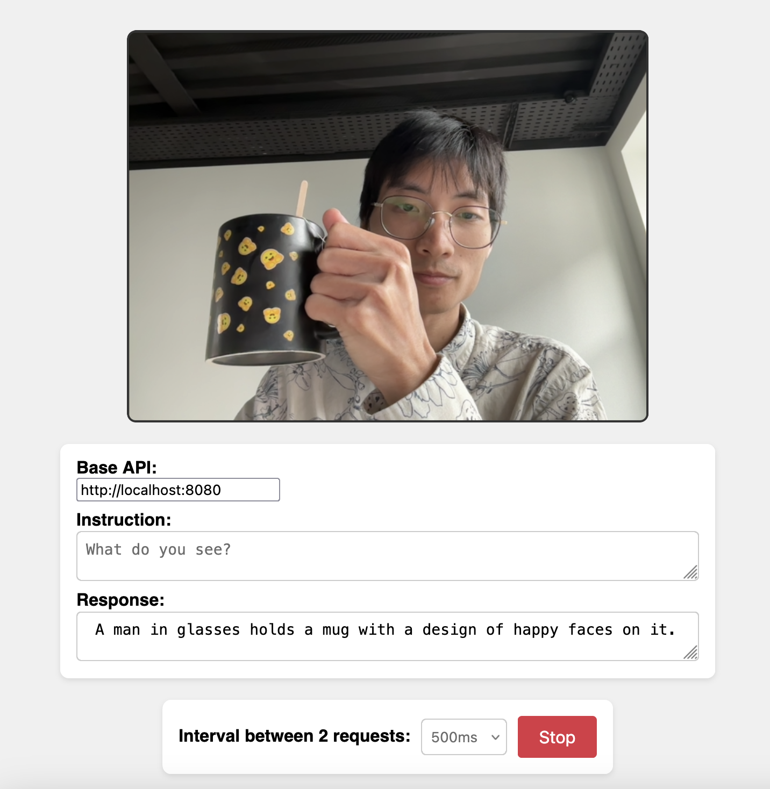

# PathsAI — SmolVLM-500M: Visión Multimodal en Tiempo Real

> **Componente de inferencia VLM del ecosistema PathsAI** — Sistema de asistencia visual para personas con discapacidad visual, desarrollado en el contexto de la **Huawei ICT Competition 2026 – Innovation Track**.



---

## Tabla de Contenidos

1. [Descripción General](#descripción-general)
2. [Arquitectura del Modelo: SmolVLM-500M](#arquitectura-del-modelo-smolvlm-500m)
3. [Cuantización con llama.cpp (GGUF)](#cuantización-con-llamacpp-gguf)
4. [Arquitectura del Sistema](#arquitectura-del-sistema)
5. [Componentes del Repositorio](#componentes-del-repositorio)
6. [API de Inferencia](#api-de-inferencia)
7. [Integración en el Ecosistema PathsAI](#integración-en-el-ecosistema-pathsai)
8. [Despliegue](#despliegue)
9. [Instalación y Uso](#instalación-y-uso)
10. [Rendimiento y Métricas](#rendimiento-y-métricas)

---

## Descripción General

Este repositorio implementa el **módulo de inferencia VLM (Vision-Language Model)** del proyecto PathsAI. Proporciona dos interfaces de interacción con el modelo SmolVLM-500M ejecutado localmente mediante `llama.cpp`:

| Interfaz | Archivo | Descripción |
|----------|---------|-------------|
| Frontend web | `index.html` | Captura webcam en tiempo real vía browser, envía frames al servidor y muestra respuestas |
| Script Python | `paths_ai_mvp.py` | Captura webcam con OpenCV, analiza frames y vocaliza respuestas mediante TTS |

El modelo actúa como **capa VLM** dentro de la arquitectura multimodal PathsAI, cuya pila completa incluye YOLOv8 (detección), SAM (segmentación), SmolVLM (comprensión semántica) y síntesis de voz.

---

## Arquitectura del Modelo: SmolVLM-500M

### Origen y Familia

SmolVLM-500M es un modelo Vision-Language de código abierto publicado por HuggingFace como parte de la familia **SmolVLM**, diseñado para inferencia eficiente en dispositivos con recursos limitados (edge computing, CPU, NPU embebido).

- **HuggingFace Hub**: `HuggingFaceTB/SmolVLM-500M-Instruct`
- **Licencia**: Apache 2.0
- **Parámetros totales**: ~500M
- **Arquitectura base**: Idefics3 (encoder-decoder multimodal)

### Componentes Internos

```
┌──────────────────────────────────────────────────────────┐
│                   SmolVLM-500M                           │
├──────────────────────────────────────────────────────────┤
│                                                          │
│  Imagen de entrada                                       │
│       │                                                  │
│       ▼                                                  │
│  ┌─────────────────────┐                                 │
│  │  SigLIP Vision      │  ← Vision Encoder               │
│  │  Encoder            │    Shape-Optimized ViT          │
│  │  So400m/14@384      │    Patch size: 14px             │
│  │                     │    Resolución: hasta 384×384    │
│  └──────────┬──────────┘                                 │
│             │ patch embeddings                           │
│             ▼                                            │
│  ┌─────────────────────┐                                 │
│  │  Pixel Shuffle      │  ← Resampler / Compressor       │
│  │  Resampler (×2)     │    Reduce tokens visuales       │
│  │                     │    Proyección a espacio LM      │
│  └──────────┬──────────┘                                 │
│             │ visual tokens comprimidos                  │
│             ▼                                            │
│  ┌─────────────────────┐                                 │
│  │  SmolLM2            │  ← Language Model (Decoder)     │
│  │  Transformer        │    Arquitectura: LLaMA-style    │
│  │  Decoder            │    Atención: GQA                │
│  │                     │    Context: 16,384 tokens       │
│  └─────────────────────┘                                 │
│             │                                            │
│             ▼                                            │
│       Texto generado                                     │
└──────────────────────────────────────────────────────────┘
```

### Parámetros Técnicos Detallados

| Parámetro | Valor |
|-----------|-------|
| Parámetros totales | ~500M |
| Vision encoder | SigLIP-So400m/14 (Shape-Optimized) |
| Language model backbone | SmolLM2 (LLaMA-style decoder) |
| Mecanismo de atención | Grouped Query Attention (GQA) |
| Longitud de contexto | 16,384 tokens |
| Resolución de imagen | Múltiple: hasta 512×512 nativo, tiles de 384×384 |
| Tokens de imagen por frame | ~729 patches → ~182 tras pixel shuffle |
| Formato de entrada imagen | RGB, normalización SigLIP |
| Vocab size | 49,152 tokens |
| Tipo de dato nativo | bfloat16 / float16 |

### Pipeline de Procesamiento de Imagen

```
Frame JPEG (480×360)
        │
        ▼
  Redimensionado al tile más cercano soportado
        │
        ▼
  SigLIP Patch Embedding (patch size 14×14)
  27×27 = 729 patches visuales
        │
        ▼
  Pixel Shuffle Resampler (factor ×2)
  → ~182 visual tokens
        │
        ▼
  Concatenación con text tokens en el LM decoder
        │
        ▼
  Generación autoregresiva (temperature 0.1, max_tokens 60)
```

### Benchmarks de Referencia

| Benchmark | SmolVLM-500M | Descripción |
|-----------|-------------|-------------|
| MMMU | ~38.8% | Razonamiento multimodal universitario |
| TextVQA | ~73.0% | Visual Question Answering con texto |
| DocVQA | ~81.6% | Comprensión de documentos |
| MMStar | ~41.5% | Benchmark multimodal general |
| MMBench | ~62.5% | Evaluación multimodal balanceada |

*Fuente: HuggingFace Model Card — SmolVLM-500M-Instruct*

---

## Cuantización con llama.cpp (GGUF)

### ¿Por qué GGUF?

El formato **GGUF** (GPT-Generated Unified Format) es el estándar de serialización de `llama.cpp`, el runtime de inferencia C++ optimizado para CPU/GPU heterogéneo. Permite:

- Cuantización mixta por capa (pesos críticos en mayor precisión)
- Inferencia eficiente en CPU sin GPU dedicada
- API OpenAI-compatible lista para producción
- Carga mediante `mmap` (memoria compartida entre procesos)

### Variantes de Cuantización

| Formato | Bits/peso | Tamaño aprox. | Uso recomendado | Pérdida calidad |
|---------|-----------|---------------|-----------------|-----------------|
| `Q8_0` | 8-bit | ~530 MB | Alta calidad, CPU potente | Mínima |
| `Q5_K_M` | 5-bit mixto | ~350 MB | Balance calidad/velocidad | Muy baja |
| `Q4_K_M` | 4-bit mixto | ~290 MB | Edge computing, RAM limitada | Baja |
| `Q4_0` | 4-bit uniforme | ~280 MB | Dispositivos muy limitados | Moderada |
| `IQ3_M` | 3-bit (importancia) | ~210 MB | Wearable embedded | Moderada-alta |

### Proceso de Cuantización desde HuggingFace

```bash
# 1. Convertir modelo HuggingFace a GGUF (float16)
python llama.cpp/convert_hf_to_gguf.py \
  HuggingFaceTB/SmolVLM-500M-Instruct \
  --outtype f16 \
  --outfile smolvlm-500m-f16.gguf

# 2. Cuantizar a Q4_K_M (recomendado para edge)
./llama.cpp/llama-quantize \
  smolvlm-500m-f16.gguf \
  smolvlm-500m-Q4_K_M.gguf \
  Q4_K_M

# 3. Iniciar servidor de inferencia
./llama.cpp/llama-server \
  --hf-repo ggml-org/SmolVLM-500M-Instruct-GGUF \
  --hf-file SmolVLM-500M-Instruct-Q4_K_M.gguf \
  --port 8080 \
  --ctx-size 8192 \
  --n-gpu-layers 0    # CPU-only; -ngl 99 para GPU completa
```

> **Nota**: El repositorio `ggml-org/SmolVLM-500M-Instruct-GGUF` en HuggingFace provee archivos GGUF listos para descargar.

### Consumo de Recursos por Variante

| Cuantización | RAM mínima | Tokens/s (CPU i7-12th) | Latencia/frame (~60 tokens) |
|---|---|---|---|
| Q8_0 | 1.2 GB | ~8–12 tok/s | ~5–8s |
| Q4_K_M | 600 MB | ~15–25 tok/s | ~2.5–4s |
| Q4_0 | 560 MB | ~18–30 tok/s | ~2–3s |
| IQ3_M | 380 MB | ~25–40 tok/s | ~1.5–2.5s |

---

## Arquitectura del Sistema

### Flujo de Datos End-to-End

```
┌─────────────────────────────────────────────────────────────┐
│                    PathsAI VLM Pipeline                     │
├─────────────────────────────────────────────────────────────┤
│                                                             │
│  ┌──────────────┐    JPEG/Base64 POST     ┌──────────────┐  │
│  │  Webcam      │ ───────────────────────►│  llama.cpp   │  │
│  │  (480×360)   │                         │  Server      │  │
│  │  30 fps      │◄─────────────────────── │  SmolVLM     │  │
│  └──────────────┘    Texto (JSON)         │  :8080       │  │
│         │                                 └──────────────┘  │
│         │                                                   │
│         ▼                                                   │
│  ┌─────────────────────────────────────────┐               │
│  │           Interface Layer               │               │
│  │                                         │               │
│  │  [index.html]         [paths_ai_mvp.py] │               │
│  │  Browser UI           Python + TTS      │               │
│  │  100ms–2s interval    3s interval       │               │
│  │  Display text         pyttsx3 audio     │               │
│  └─────────────────────────────────────────┘               │
└─────────────────────────────────────────────────────────────┘
```

### Protocolo de Comunicación

El servidor llama.cpp expone una **API OpenAI-compatible**. Cada inferencia multimodal envía:

```json
{
  "max_tokens": 60,
  "temperature": 0.1,
  "messages": [
    {
      "role": "user",
      "content": [
        {
          "type": "image_url",
          "image_url": {
            "url": "data:image/jpeg;base64,<BASE64_FRAME>"
          }
        },
        {
          "type": "text",
          "text": "¿Qué obstáculos hay? Responde en español, 2 frases máximo."
        }
      ]
    }
  ]
}
```

**Respuesta del servidor:**
```json
{
  "choices": [
    {
      "message": {
        "role": "assistant",
        "content": "Hay una persona caminando a 3 metros. Se observa una silla en el camino."
      }
    }
  ]
}
```

---

## Componentes del Repositorio

### `index.html` — Frontend Web en Tiempo Real

Aplicación web estática (cero dependencias externas) que:

1. Solicita acceso a cámara mediante `navigator.mediaDevices.getUserMedia()`
2. Renderiza el stream en `<video>` (480×360px)
3. Captura frames con `canvas.toDataURL('image/jpeg', 0.8)` (JPEG quality 0.8)
4. Envía frames a `POST /v1/chat/completions` en intervalos configurables
5. Muestra la respuesta de texto en tiempo real

**Parámetros configurables desde UI:**

| Campo | Default | Descripción |
|-------|---------|-------------|
| Base API URL | `http://localhost:8080` | Dirección del servidor llama.cpp |
| Instruction | `"What do you see?"` | Prompt enviado con cada frame |
| Interval | `500ms` | Frecuencia entre solicitudes (100ms–2s) |

**Control de concurrencia:**
```javascript
// Guard: evita requests solapados si la inferencia
// tarda más que el intervalo configurado
if (!isProcessing) return;
```

### `paths_ai_mvp.py` — Asistente Visual con TTS

Script Python de producción para navegación verbal de personas invidentes.

**Pipeline de ejecución:**

```
OpenCV VideoCapture(0)
    │  cap.read() → resize(480×360) → imencode('.jpg', quality=80)
    ▼
base64.b64encode(jpeg_bytes) → data:image/jpeg;base64,...
    │
    ▼
requests.post('/v1/chat/completions', timeout=30)
    │  max_tokens=60, temperature=0.1
    ▼
Deduplicación: text != last_response
    │
    ▼
threading.Thread(target=pyttsx3.say, daemon=True)
    # TTS asíncrono — no bloquea el loop de captura
```

**Gestión de estado threading:**

| Variable | Tipo | Propósito |
|----------|------|-----------|
| `running` | `bool` | Flag de SIGINT para shutdown limpio |
| `is_speaking` | `threading.Event` | Evita capturar frame mientras TTS activo |
| `tts_lock` | `threading.Lock` | Mutex en el engine pyttsx3 |
| `last_response` | `str` | Deduplicación de respuestas idénticas |

**Argumentos CLI:**

| Argumento | Default | Descripción |
|-----------|---------|-------------|
| `--interval` | `3.0` | Segundos entre capturas |
| `--url` | `http://localhost:8080` | URL del servidor llama.cpp |
| `--lang` | `es` | Idioma del motor TTS (busca voz coincidente por ID) |

### `pyproject.toml` — Metadatos y Dependencias

```toml
[project]
name = "smolvlm-realtime-webcam"
version = "0.1.0"
requires-python = ">=3.14"
dependencies = [
    "opencv-python>=4.13.0.92",   # Captura y procesamiento de frames
    "pyttsx3>=2.99",               # Text-to-Speech multiplataforma (espeak/SAPI/NSSpeech)
    "requests>=2.32.5",            # HTTP cliente para llama.cpp API
]
```

---

## API de Inferencia

### Endpoints del Servidor llama.cpp

| Endpoint | Método | Descripción |
|----------|--------|-------------|
| `/v1/chat/completions` | POST | Inferencia multimodal (texto + imagen Base64) |
| `/v1/models` | GET | Lista de modelos cargados |
| `/health` | GET | Estado del servidor (liveness) |
| `/metrics` | GET | Métricas en formato Prometheus |

### Ejemplo con curl

```bash
IMAGE_B64=$(base64 -w 0 frame.jpg)

curl http://localhost:8080/v1/chat/completions \
  -H "Content-Type: application/json" \
  -d "{
    \"max_tokens\": 60,
    \"temperature\": 0.1,
    \"messages\": [{
      \"role\": \"user\",
      \"content\": [
        {\"type\": \"image_url\",
         \"image_url\": {\"url\": \"data:image/jpeg;base64,${IMAGE_B64}\"}},
        {\"type\": \"text\",
         \"text\": \"¿Qué obstáculos hay?\"}
      ]
    }]
  }"
```

### Configuración de Servidor para Producción

```bash
./llama-server \
  --hf-repo ggml-org/SmolVLM-500M-Instruct-GGUF \
  --hf-file SmolVLM-500M-Instruct-Q4_K_M.gguf \
  --port 8080 \
  --host 0.0.0.0 \
  --ctx-size 8192 \
  --threads 4 \
  --n-predict 100 \
  --timeout 30 \
  --log-disable
```

---

## Integración en el Ecosistema PathsAI

SmolVLM actúa como el **componente VLM** dentro de la arquitectura multimodal PathsAI (Huawei ICT Competition 2026). La pila completa de IA es:

```
┌────────────────────────────────────────────────────────────────┐
│                    PATHSAI AI PIPELINE                         │
│              (Arquitectura PathsAI — ICT Innovation)           │
├────────────────────────────────────────────────────────────────┤
│                                                                │
│  Input: Frame de cámara HD (30fps) + LiDAR (0.5m–10m, ±2cm)  │
│         │                                                      │
│         ├─────────────────────────────────────────────────┐   │
│         │                                                 │   │
│         ▼                                                 ▼   │
│  ┌──────────────────┐                    ┌─────────────────┐  │
│  │  YOLOv8-nano     │                    │  LiDAR          │  │
│  │  (Edge, <100ms)  │                    │  Projective     │  │
│  │  MindSpore Lite  │                    │  Transform +    │  │
│  │  HiSilicon NPU   │                    │  GAN Refiner    │  │
│  └────────┬─────────┘                    └────────┬────────┘  │
│           │ Bounding boxes                        │           │
│           ▼                                       │           │
│  ┌──────────────────┐                             │           │
│  │  SAM             │◄────────────────────────────┘           │
│  │  Segmentación    │   Fusión LiDAR + visión                 │
│  │  IoU > 90%       │   (Segment Anything Model)              │
│  └────────┬─────────┘                                         │
│           │ Masks + context patches                           │
│           ▼                                                   │
│  ┌──────────────────┐                                         │
│  │  SmolVLM-500M    │  ← Este repositorio                     │
│  │  GGUF Q4_K_M     │    Comprensión semántica en lenguaje    │
│  │  llama.cpp       │    natural del entorno visual           │
│  │  API: :8080      │    "Hay un bache a 2 metros a la        │
│  └────────┬─────────┘     izquierda. Continúa recto."        │
│           │ Texto en lenguaje natural                         │
│           ▼                                                   │
│  ┌──────────────────────────────────────────────┐            │
│  │  Wave Model / TTS                            │            │
│  │  Bidirectional LSTM + 3 Conv Layers          │            │
│  │  + WaveNet MoL (Mel Spectrogram)             │            │
│  │  ó pyttsx3 (espeak) para MVP                │            │
│  └──────────────────────────────────────────────┘            │
│           │                                                   │
│           ▼                                                   │
│  Output: Audio → Audífonos Bluetooth del usuario              │
└────────────────────────────────────────────────────────────────┘
```

### Tabla de Modelos en PathsAI

| Modelo | Propósito | Framework | Target hardware | Latencia objetivo |
|--------|-----------|-----------|-----------------|-------------------|
| YOLOv8-nano | Detección de objetos (edge-first) | MindSpore Lite / CANN | HiSilicon Kirin NPU | <100ms |
| SAM / FastSAM-s | Segmentación de instancias | PyTorch / MindSpore | Ascend 310 / GPU | <200ms |
| **SmolVLM-500M** | Comprensión semántica VLM | llama.cpp (GGUF) | CPU / GPU / Ascend | 1.5–5s |
| WaveNet MoL / pyttsx3 | Síntesis de voz (TTS) | MindSpore / nativo | CPU / Huawei SIS | <500ms |

### Clases de Obstáculos Detectadas

```python
OBSTACLE_CLASSES = [
    "pothole",        # Bache
    "stairs",         # Escaleras
    "obstacle",       # Obstáculo general
    "wet_floor",      # Piso mojado
    "sidewalk_edge",  # Borde de acera
    "street_vendor",  # Comercio ambulante
    "construction",   # Zona de construcción
    "vehicle",        # Vehículo
]
```

---

## Despliegue

### Opción 1: Local — Desarrollo y MVP

```bash
# Terminal 1: Servidor de inferencia SmolVLM
llama-server \
  -hf ggml-org/SmolVLM-500M-Instruct-GGUF \
  --port 8080
  # Añadir -ngl 99 para usar GPU (NVIDIA/AMD/Intel)

# Terminal 2a: Frontend web
python3 -m http.server 3000
# Abrir http://localhost:3000 en el navegador

# Terminal 2b: Script Python con TTS (asistente verbal)
uv run python paths_ai_mvp.py --interval 3 --lang es
```

### Opción 2: Docker — Contenedor de Inferencia

```dockerfile
FROM debian:bookworm-slim

RUN apt-get update && apt-get install -y curl ca-certificates && \
    curl -Lo /usr/local/bin/llama-server \
    https://github.com/ggerganov/llama.cpp/releases/latest/download/llama-server-linux-x86_64 \
    && chmod +x /usr/local/bin/llama-server

EXPOSE 8080
HEALTHCHECK --interval=30s --timeout=10s \
  CMD curl -f http://localhost:8080/health || exit 1

CMD ["llama-server", \
     "--hf-repo", "ggml-org/SmolVLM-500M-Instruct-GGUF", \
     "--hf-file", "SmolVLM-500M-Instruct-Q4_K_M.gguf", \
     "--port", "8080", "--host", "0.0.0.0", \
     "--ctx-size", "4096", "--threads", "4"]
```

```bash
docker build -t pathsai-vlm .
docker run -p 8080:8080 pathsai-vlm
```

### Opción 3: Huawei Cloud CCE — Producción

Despliegue de producción sobre **Huawei Cloud CCE** (Cloud Container Engine) siguiendo la arquitectura ICT Innovation PathsAI.

#### Servicios Huawei Cloud Involucrados

| Servicio | Rol | Protocolo |
|----------|-----|-----------|
| **CCE** — Cloud Container Engine | Orquestación Kubernetes de pods llama.cpp | Kubernetes API |
| **APIG** — API Gateway | Exponer `/v1/chat/completions` con OAuth 2.0 + rate limiting | HTTPS / REST |
| **ELB** — Elastic Load Balancer | Balanceo entre réplicas VLM | HTTP/2 |
| **OBS** — Object Storage | Almacenamiento de modelos GGUF + logs de frames | S3-compatible |
| **IEF** — Intelligent EdgeFabric | Deploy del modelo ligero Q4_0 en wearable edge | MQTT + KubeEdge |
| **IoTDA** — IoT Device Access | Autenticación y telemetría del wearable | MQTT over TLS 1.3 |
| **SIS** — Speech Interaction Service | TTS cloud-based de alta calidad (alternativa a pyttsx3) | gRPC / WebSocket |
| **ModelArts** | Reentrenamiento y fine-tuning del VLM con nuevos datasets urbanos | MindSpore |
| **FunctionGraph** | Trigger serverless para análisis batch de frames | Event-driven |
| **GaussDB NoSQL** | Base de datos geoespacial de obstáculos detectados | GeoJSON + GeoIndex |
| **DCS** — Redis Cache | Caché de respuestas VLM frecuentes por zona geográfica | Redis Protocol |

#### Manifesto Kubernetes (Deployment + HPA)

```yaml
apiVersion: apps/v1
kind: Deployment
metadata:
  name: smolvlm-vlm-service
  namespace: ai-inference
  labels:
    app: pathsai-vlm
    version: "500m-q4km"
spec:
  replicas: 2
  selector:
    matchLabels:
      app: pathsai-vlm
  template:
    metadata:
      labels:
        app: pathsai-vlm
    spec:
      containers:
      - name: llama-server
        image: ghcr.io/ggerganov/llama.cpp:server
        args:
          - "--hf-repo"
          - "ggml-org/SmolVLM-500M-Instruct-GGUF"
          - "--hf-file"
          - "SmolVLM-500M-Instruct-Q4_K_M.gguf"
          - "--port"
          - "8080"
          - "--host"
          - "0.0.0.0"
          - "--ctx-size"
          - "4096"
          - "--threads"
          - "4"
        ports:
        - containerPort: 8080
        resources:
          requests:
            memory: "1Gi"
            cpu: "2"
          limits:
            memory: "2Gi"
            cpu: "4"
        livenessProbe:
          httpGet:
            path: /health
            port: 8080
          initialDelaySeconds: 60
          periodSeconds: 30
        readinessProbe:
          httpGet:
            path: /health
            port: 8080
          initialDelaySeconds: 30
          periodSeconds: 10
---
apiVersion: v1
kind: Service
metadata:
  name: vlm-service
  namespace: ai-inference
spec:
  selector:
    app: pathsai-vlm
  ports:
  - port: 8080
    targetPort: 8080
  type: ClusterIP
---
apiVersion: autoscaling/v2
kind: HorizontalPodAutoscaler
metadata:
  name: vlm-hpa
  namespace: ai-inference
spec:
  scaleTargetRef:
    apiVersion: apps/v1
    kind: Deployment
    name: smolvlm-vlm-service
  minReplicas: 2
  maxReplicas: 8
  metrics:
  - type: Resource
    resource:
      name: cpu
      target:
        type: Utilization
        averageUtilization: 70
  - type: Resource
    resource:
      name: memory
      target:
        type: Utilization
        averageUtilization: 80
```

#### Flujo de CI/CD en Huawei Cloud

```
ModelArts Studio (fine-tuning + evaluación)
    │
    ▼
Exportar modelo → GGUF (via llama.cpp convert)
    │
    ▼
OBS: s3://pathsai-models/smolvlm-q4km-vX.Y.gguf
    │
    ▼
CCE Rolling Update (pull desde OBS al arrancar pod)
    │
    ├── vlm-pod-1 (réplica activa)
    └── vlm-pod-2 (réplica activa)
         │
         ▼
    ELB → APIG (OAuth 2.0, rate limiting, WAF)
         │
         ▼
    App Móvil PathsAI / Dispositivo IoT Wearable
```

### Opción 4: Edge IoT — Dispositivo Wearable PathsAI

Para el wearable con **NPU HiSilicon Kirin** gestionado por **Huawei IEF**:

```bash
# En dispositivo ARM64 (HarmonyOS / Linux embebido)
./llama-server-arm64 \
  --model smolvlm-500m-Q4_0.gguf \   # Variante más ligera para edge
  --port 8080 \
  --threads 2 \
  --ctx-size 2048

# El dispositivo recibe frames localmente (sin latencia de red)
# y reporta detecciones via MQTT → Huawei IEF → IoTDA
```

> **Roadmap técnico**: Integrar SmolVLM con **CANN** (Compute Architecture for Neural Networks) de Huawei para aceleración en Ascend 310, proyectando reducir latencia de ~3s a <500ms en dispositivo edge.

---

## Instalación y Uso

### Requisitos del Sistema

| Componente | Mínimo | Recomendado |
|---|---|---|
| Python | 3.14+ | 3.14+ |
| RAM | 700 MB libres | 2 GB libres |
| CPU | 2 cores | 4+ cores |
| OS | Linux / macOS / Windows | Linux |
| Webcam | Cualquier V4L2 | 1080p |
| llama.cpp | build reciente | build con GPU |

### Instalación

```bash
# 1. Clonar repositorio
git clone https://github.com/ngxson/smolvlm-realtime-webcam.git
cd smolvlm-realtime-webcam

# 2. Instalar dependencias Python
uv sync
# ó: pip install opencv-python pyttsx3 requests

# 3. (Linux) Instalar espeak para TTS
sudo apt install espeak          # Debian/Ubuntu
sudo dnf install espeak-ng       # Fedora/RHEL

# 4. Descargar e instalar llama.cpp
# Ver: https://github.com/ggerganov/llama.cpp/releases
# ó compilar desde fuentes con soporte GPU

# 5. Levantar servidor SmolVLM
llama-server \
  -hf ggml-org/SmolVLM-500M-Instruct-GGUF \
  --port 8080
  # -ngl 99   para usar GPU NVIDIA/AMD/Intel
```

### Ejecución

**Frontend web (demo interactivo):**
```bash
python3 -m http.server 3000
# Abrir http://localhost:3000/index.html
```

**Asistente verbal PathsAI (producción MVP):**
```bash
# Básico
uv run python paths_ai_mvp.py

# Con todas las opciones
uv run python paths_ai_mvp.py \
  --interval 3 \
  --url http://localhost:8080 \
  --lang es

# Servidor remoto (wearable → servidor cloud)
uv run python paths_ai_mvp.py \
  --interval 2 \
  --url http://192.168.1.100:8080

# Detener: Ctrl+C (shutdown limpio de webcam y TTS)
```

---

## Rendimiento y Métricas

### Latencia del Pipeline Completo

```
Captura frame (JPEG 480×360, quality=0.8)       ~5ms
Base64 encode                                    ~2ms
HTTP POST (localhost)                            ~1ms
Tokenización de imagen (llama.cpp)               ~50ms
Inferencia SmolVLM Q4_K_M (60 tokens, CPU i7)   ~1500–3000ms  ← cuello de botella
HTTP response + JSON parse                       ~2ms
TTS pyttsx3 synthesis + playback                ~500–1500ms
────────────────────────────────────────────────────────────
Total pipeline (CPU i7-12th, Q4_K_M, sin GPU)   ~2–5s
```

### Configuración Óptima por Caso de Uso

| Caso de uso | Cuantización | Intervalo | max_tokens | temperature |
|---|---|---|---|---|
| Demo interactivo (web) | Q4_K_M | 500ms | 100 | 0.3 |
| Asistente voz MVP | Q4_K_M | 3s | 60 | 0.1 |
| Alta precisión semántica | Q8_0 | 5s | 150 | 0.1 |
| Edge wearable IoT | Q4_0 / IQ3_M | 2s | 40 | 0.1 |
| Cloud CCE (producción) | Q5_K_M | 1s | 80 | 0.1 |

### Comparativa SmolVLM-500M vs Alternativas

| Modelo | Parámetros | GGUF size (Q4) | Req. RAM | MMMU | Adecuado para edge |
|--------|-----------|---------------|----------|------|--------------------|
| **SmolVLM-500M** | 500M | ~290MB | ~600MB | 38.8% | Sí |
| SmolVLM-256M | 256M | ~160MB | ~400MB | ~35% | Sí (muy limitado) |
| LLaVA-1.5-7B | 7B | ~4.1GB | ~6GB | 36.2% | No |
| Qwen2-VL-2B | 2B | ~1.2GB | ~2GB | 41.1% | Parcial |
| MiniCPM-V-2.6 | 8B | ~4.8GB | ~8GB | 49.8% | No |

---

## Estructura del Repositorio

```
smolvlm-realtime-webcam/
├── index.html           # Frontend web: captura webcam + UI tiempo real
├── paths_ai_mvp.py      # Script Python: webcam → VLM → TTS (asistente voz)
├── pyproject.toml       # Metadatos del proyecto y dependencias Python
├── uv.lock              # Lock file reproducible de dependencias (uv)
├── demo.png             # Captura de pantalla del demo en ejecución
└── LICENSE              # Licencia del proyecto (MIT)
```

---

## Referencias

- [SmolVLM-500M-Instruct — HuggingFace Model Card](https://huggingface.co/HuggingFaceTB/SmolVLM-500M-Instruct)
- [SmolVLM GGUF — ggml-org](https://huggingface.co/ggml-org/SmolVLM-500M-Instruct-GGUF)
- [llama.cpp — GitHub](https://github.com/ggerganov/llama.cpp)
- [llama.cpp Multimodal Support](https://github.com/ggerganov/llama.cpp/blob/master/docs/multimodal.md)
- [Idefics3 Architecture — HuggingFace Blog](https://huggingface.co/blog/idefics3)
- [SigLIP: Sigmoid Loss for Language Image Pre-Training (arXiv:2303.15343)](https://arxiv.org/abs/2303.15343)
- [SmolLM2 — HuggingFace](https://huggingface.co/HuggingFaceTB/SmolLM2-135M)
- [PathsAI — Arquitectura Completa en Huawei Cloud](../ict-inovation-vistas-app/ARQUITECTURA_COMPLETA_PATHSAI.md)
- [ICT Innovation — Repositorio de Visión Artificial](../ict-inovation/)
- [Huawei ICT Competition 2026](https://e.huawei.com/en/talent/ict/#/)

---

> **Proyecto**: PathsAI — Huawei ICT Competition 2026, Innovation Track
> **Equipo**: ICT Innovation
> **Stack**: SmolVLM-500M (HuggingFace) + llama.cpp GGUF + Huawei Cloud CCE / IEF / SIS
> **Licencia**: Apache 2.0
